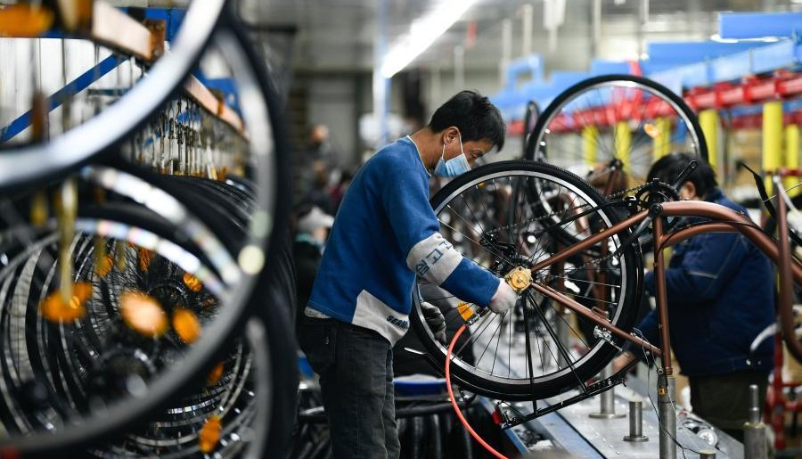
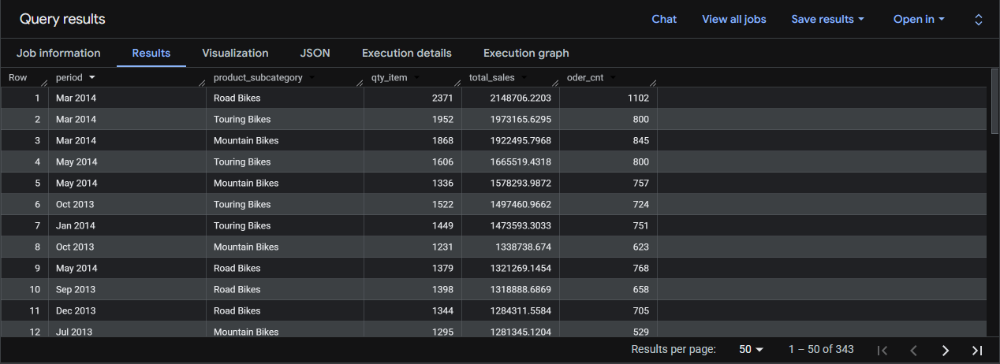

---

# 🚲 Bicycle Manufacturer Performance Analysis


---

<p align="center">
  
</p>


## 1. 📌 Overview

**Objective:**

- This project uses SQL (Google BigQuery) to analyze sales, production, and purchasing data from the **AdventureWorks dataset**
- It answers 8 specific business questions covering **Sales Performance, Customer Retention, and Inventory Optimization**
- The goal is to turn raw transactional and operational data into clear, actionable insights for the business

**Main business question:**

This project uses SQL to analyze sales, inventory, and purchasing data from AdventureWorks to:
- Identify which product categories, territories, and time periods drive the most sales
- Evaluate how discounts, customer retention, and stock levels affect overall business performance

**👤 Who is this project for?**

- **Data analysts & business analysts** who want a reference for writing analytical SQL (CTEs, window functions, cohort analysis)
- **Decision-makers & stakeholders** who need quick insights into sales trends, inventory health, and supplier performance

### 📑 Table of Contents

- [1. Overview](#1-overview)
- [2. Dataset](#2-dataset)
- [3. Full Query Repository](#3-full-query-repository)
- [4. Project Structure](#4-project-structure)
- [5. Setup Instructions](#5-setup-instructions)

---

## 2. 📂 Dataset

The analysis is based on the **AdventureWorks database**, which represents a large bicycle manufacturing and sales company operating internationally. It contains data on products, customers, sales orders, purchasing, and inventory across many regions.

### Data Dictionary

To answer the 8 business questions in this project, **8 tables** from the `Sales`, `Production`, and `Purchasing` schemas were used. The table below lists only the columns that were actually used.

> 🔗 **Full Documentation:** For the complete Data Dictionary of the entire AdventureWorks dataset, see the [Official Data Dictionary (PDF)](https://drive.google.com/file/d/1bwwsS3cRJYOg1cvNppc1K_8dQLELN16T/view).

| Schema | Table Name | Columns Used | Used In | Purpose |
| :--- | :--- | :--- | :--- | :--- |
| **Sales** | `SalesOrderHeader` | `SalesOrderID`, `OrderDate`, `CustomerID`, `TerritoryID`, `Status`, `ModifiedDate` | Q1, Q2, Q3, Q4, Q5 | Provides order dates, territory IDs, customer IDs, and order status for sales-side queries. |
| **Sales** | `SalesOrderDetail` | `SalesOrderID`, `ProductID`, `OrderQty`, `LineTotal`, `UnitPrice`, `SpecialOfferID` | Q1, Q2, Q3, Q4, Q7 | Line-item table holding order quantities, revenue, and prices used to calculate sales volume and totals. |
| **Sales** | `SpecialOffer` | `SpecialOfferID`, `DiscountPct`, `Type` | Q4 | Identifies "Seasonal Discount" offers and their discount percentages to calculate discount cost. |
| **Production** | `Product` | `ProductID`, `Name`, `ProductSubcategoryID` | Q1, Q2, Q4, Q6, Q7 | Maps product IDs to product names and subcategory IDs. |
| **Production** | `ProductSubcategory` | `ProductSubcategoryID`, `Name` | Q1, Q2, Q4 | Groups products into subcategories for sales volume and YoY growth comparisons. |
| **Production** | `WorkOrder` | `ProductID`, `StockedQty`, `ModifiedDate` | Q6, Q7 | Supplies stocked quantities by month, used for stock trend and stock-to-sales ratio. |
| **Purchasing** | `PurchaseOrderHeader` | `PurchaseOrderID`, `Status`, `TotalDue`, `ModifiedDate` | Q8 | Provides purchase order status and total value to find Pending (`Status = 1`) orders in 2014. |
| **Purchasing** | `PurchaseOrderDetail` | `PurchaseOrderID` | Q8 | Joined to the purchase order header to count distinct pending purchase orders. |

---

## 3. 🔎 Full Query Repository

Below are all 8 queries with their logic and a sample of the results returned in BigQuery.

<details>
<summary><b>Query 1: Sales Volume L12M</b> (Click to expand)</summary>

*Question: Calc Quantity of items, Sales value & Order quantity by each Subcategory in L12M.*

```sql
WITH
  sales_order_with_date AS(
  ...
```
**📊 Actual Output:**


---

## 4. 🗂️ Project Structure

```text
Bicycle_Manufacturer_Performance_Analysis-main/
├── Images/                             # Screenshots of each query's result
│   ├── banner.jpg
│   ├── Query_1_Output.jpg
│   ...
├── SQL_Queries/                        # SQL source files for each question
│   ├── Q1 Sales Volume L12M.sql
│   ...
└── README.md
```

---

## 5. 🚀 Setup Instructions

To run these queries in **Google BigQuery**:

1. **☁️ Set up a Google Cloud Platform (GCP) account:** Create one if you don't have it yet, and enable the BigQuery API.
2. **📥 Load the dataset:** You'll need the `adventureworks2019` dataset. CSV exports of the open-source Microsoft AdventureWorks database are available online. Create a dataset named `adventureworks2019` in your BigQuery project and upload the required tables.
3. **📂 Clone this repository:**
```bash
https://github.com/TascoGitGud/Bicycle-Manufacturer-Performance-Analysis-Using-SQL.git
```
4. **▶️ Run the queries:** Open the BigQuery console, copy each `.sql` file's content from the `SQL_Queries/` folder, and make sure your project context matches the dataset path before running.

---
